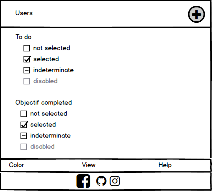

# todolist-json

**Todo Json** is a web page creat for help peaople with all task they do it for a day or for a week.
It is possible to choose your time exmeple :

* do for the day => red (this options can't be changed)

* dor for the week => orange (this options can't be changed)

* do for a month => green (this options can't be changed)

with that, you can see your priority and be more organised.
We have installe an option for the template color if you dislike the basic template.

## Logbook

* 9/12/2019

-Start project.

-Set up graphical charter.

-Set up layout.

-Task distribution.

* 10/12/2019

-Sanitary et tchek data "task"

-Storage data to fichier.json

-More style.css

-Animation whit add button

* 11/12/2019

-Workshop Design Innovation

* 12/12/2019

-Add framwork materialize

-Debug php transferred

-Storage data

* 13/12/2019

-Push "task" into index

-Search about ajax

* 14/12/2019

-Search about ajax

* 15/12/2019

-try to include ajax

-try to include drag and drop

* 16/12/2019
[...]

## Features

* It's possible to creat a task to do.
* When you have completed a task the square gets gray and it goes from the "complete" dimension.
* Possibility of changing the colors of the theme.

## Which technologies

* **Javascript**

* **php**

* **HTML**

* **Sass**

## Team

* [Issam Boumarouane](https://www.linkedin.com/in/issam-boumarouane/)
* [Vincent Vissers](https://www.linkedin.com/in/vincent-vissers/)

## The End

